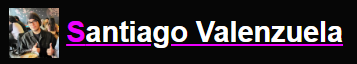
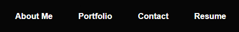
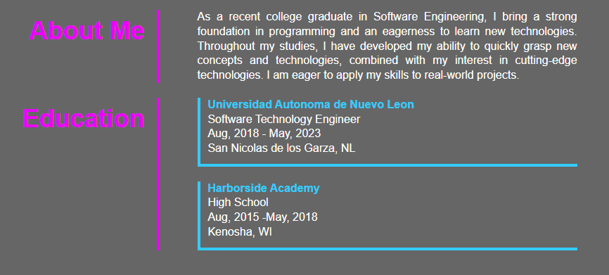
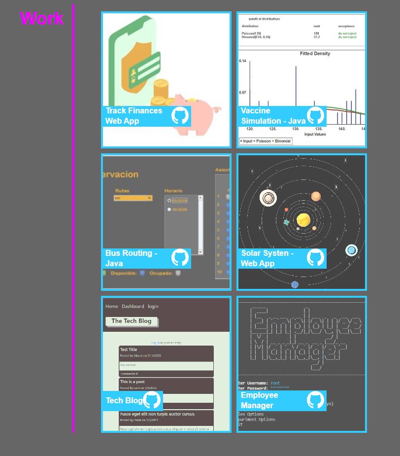
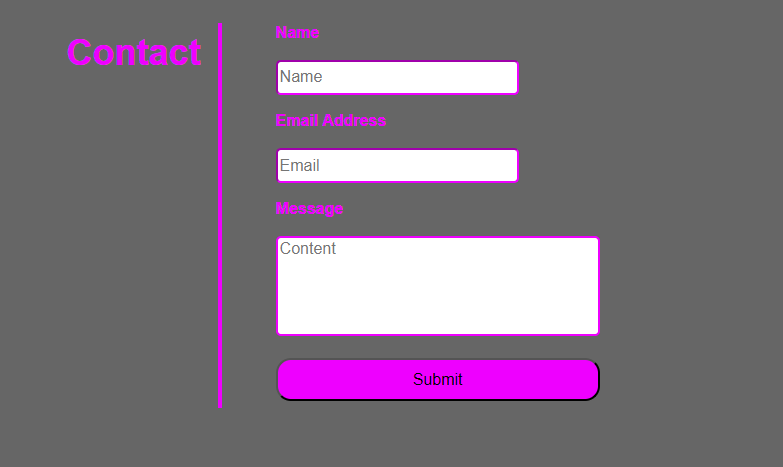
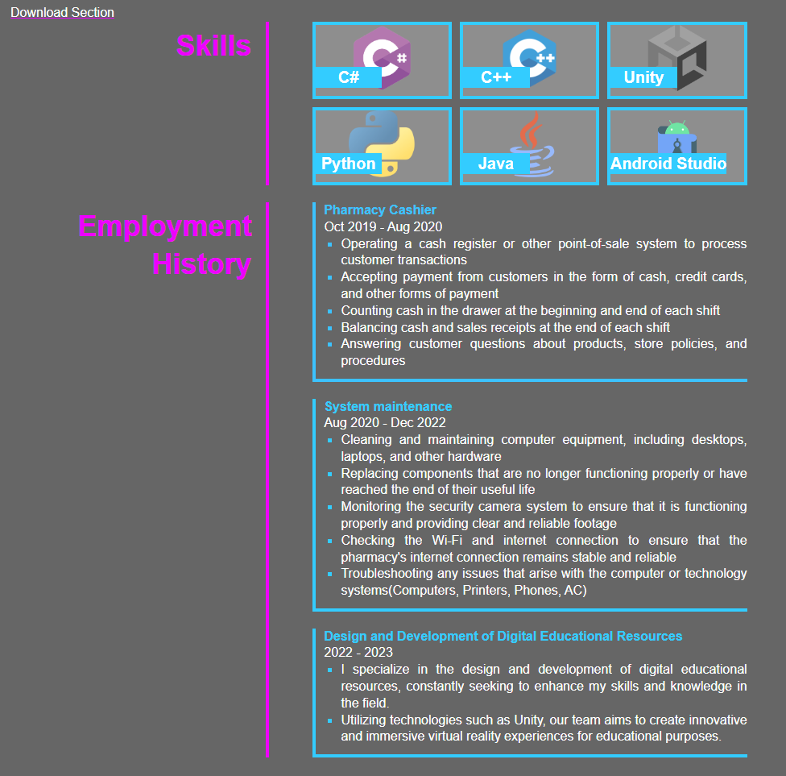

[](https://santis1001.github.io/React-Portfolio/)
<sub style='font-weight: bold;'>* This is a link to the gh-pages deployment. Click to get redirected to the page.</sub>

# React-Portfolio
20 Challenge

## Description

In this challenge, we setup a React app which will handle the front end of out app. Using this framework , we create a dynamic and engaging online presence that showcases our skills and accomplishments. The portfolio website is designed to have several key sections:

## User Story

```md
AS AN employer looking for candidates with experience building single-page applications
I WANT to view a potential employee's deployed React portfolio of work samples
SO THAT I can assess whether they're a good candidate for an open position
```

## Acceptance Criteria

```md
GIVEN a single-page application portfolio for a web developer
WHEN I load the portfolio
THEN I am presented with a page containing a header, a section for content, and a footer
WHEN I view the header
THEN I am presented with the developer's name and navigation with titles corresponding to different sections of the portfolio
WHEN I view the navigation titles
THEN I am presented with the titles About Me, Portfolio, Contact, and Resume, and the title corresponding to the current section is highlighted
WHEN I click on a navigation title
THEN I am presented with the corresponding section below the navigation without the page reloading and that title is highlighted
WHEN I load the portfolio the first time
THEN the About Me title and section are selected by default
WHEN I am presented with the About Me section
THEN I see a recent photo or avatar of the developer and a short bio about them
WHEN I am presented with the Portfolio section
THEN I see titled images of six of the developer’s applications with links to both the deployed applications and the corresponding GitHub repositories
WHEN I am presented with the Contact section
THEN I see a contact form with fields for a name, an email address, and a message
WHEN I move my cursor out of one of the form fields without entering text
THEN I receive a notification that this field is required
WHEN I enter text into the email address field
THEN I receive a notification if I have entered an invalid email address
WHEN I am presented with the Resume section
THEN I see a link to a downloadable resume and a list of the developer’s proficiencies
WHEN I view the footer
THEN I am presented with text or icon links to the developer’s GitHub and LinkedIn profiles, and their profile on a third platform (Stack Overflow, Twitter)
```

## Usage

### Project Setup

Create the React App
```md
> npx create-react-app app-name
```

Run the app locally
```md
> npm start
```

Deploy the app to github pages with custom script
* install gh-pages dependency
* create branch to where the build will be saved
* commit build 
* deploy app from branch

To update the build using git terminal

**add to scripts section in** `package.json`
```
  "scripts": {
    "deploy": "npm run build && gh-pages -d build"
```
```md
> npm run deploy
```

## Components

### Header

```js
const Header = ({currentPage, handlePageChange}) => {
    return (
        <header>
            <div class="header_title">
                
                <h1>Santiago Valenzuela </h1>
            </div> 
            <NavBar currentPage={currentPage} handlePageChange={handlePageChange}/>
            
        </header>
    );
}
```
### Navigation Bar

```js
const Navigation = ({currentPage, handlePageChange }) => {
    return (
        <nav class='navigation'>
            <div class="dropmenu">
                <h3 class="menu">Menu</h3>
            </div>

            <ul class="container_nav">
                <li id="am">
                    <div class="header_list_spacer" id="hcs1">
                        <div class="header_card_spacer" ></div>
                    </div>
                    <div class="header_card" >
                        <a href="#About-Me" onClick={() => handlePageChange('aboutme')} className={currentPage==='aboutme'?'active':'sleep'} >
                            <h3>About Me</h3>
                        </a>
                    </div>
                    <div class="header_list_spacer" id="hcs2">
                        <div class="header_card_spacer" ></div>
                    </div>
                </li>

                <li id="pf">
                    <div class="header_list_spacer" id="hcs2_2">
                        <div class="header_card_spacer" ></div>
                    </div>
                    <div class="header_card" >
                        <a href="#Portfolio" onClick={() => handlePageChange('portfolio')} className={currentPage==='portfolio'?'active':'sleep'} >
                            <h3>Portfolio</h3>
                        </a>
                    </div>
                    <div class="header_list_spacer" id="hcs3">
                        <div class="header_card_spacer"></div>
                    </div>
                </li>
                <li id="ct">
                    <div class="header_list_spacer" id="hcs3_2">
                        <div class="header_card_spacer"></div>
                    </div>
                    <div class="header_card" >
                        <a href="#Contact" onClick={() => handlePageChange('contact')} className={currentPage==='contact'?'active':'sleep'} >
                            <h3>Contact</h3>
                        </a>
                    </div>
                    <div class="header_list_spacer" id="hcs4">
                        <div class="header_card_spacer" ></div>
                    </div>
                </li>

                <li id="rm">
                    <div class="header_list_spacer" id="hcs4_2">
                        <div class="header_card_spacer" ></div>
                    </div>
                    <div class="header_card">
                        <a href="#Resume" onClick={() => handlePageChange('resume')} className={currentPage==='resume'?'active':'sleep'} >
                            <h3>Resume</h3>
                        </a>
                    </div>
                    <div class="header_list_spacer" id="hcs5">
                        <div class="header_card_spacer"></div>
                    </div>
                </li>
            </ul>
        </nav>
    );
}
```
### Footer

```js
const Footer = () => {
    return (
        <footer>
            <div>
                <h2>Contact</h2>
                <ul class="contact">
                    <li>
                        <a href="mailto:santis1001@gmail.com">
                            
                        </a>
                    </li>
                    <li>
                        <a href="https://github.com/santis1001">
                            
                        </a>
                    </li>
                    <li>
                        <a href="https://www.linkedin.com/in/santiago-valenzuela-/">
                            
                        </a>
                    </li>
                </ul>
            </div>
        </footer>
    );
}
```
### Body Components
##
#### About me

```js
const About_Me = () => {
    return (
        <div>
            <section class="About_me">
                <div class="subtitle">
                    <h2 id="About_me">About Me</h2>
                </div>
                <p>As a recent college graduate in Software Engineering, I bring a strong foundation in programming and an eagerness to learn new technologies. Throughout my studies, I have developed my ability to quickly grasp new concepts and technologies, combined with my interest in cutting-edge technologies. I am eager to apply my skills to real-world projects.</p>
            </section>
            <br/>
                <section class="Education">
                    <div class="subtitle">
                        <h2 id="Education">Education</h2>
                    </div>
                    <ul class="edu_list">
                        <li>
                            <a href="https://www.uanl.mx/">
                                <div class="uni">
                                    <h3>Universidad Autonoma de Nuevo Leon</h3>
                                    <ul>
                                        <li>Software Technology Engineer</li>
                                        <li>Aug, 2018 - May, 2023</li>
                                        <li>San Nicolas de los Garza, NL</li>
                                    </ul>
                                </div>
                            </a>
                        </li>
                        <br/>
                            <li>
                                <a href="https://kusd.edu/harborside/">
                                    <div class="high">
                                        <h3>Harborside Academy</h3>
                                        <ul>
                                            <li>High School</li>
                                            <li>Aug, 2015 -May, 2018</li>
                                            <li>Kenosha, WI</li>
                                        </ul>
                                    </div>
                                </a>
                            </li>
                    </ul>

                </section>
        </div>
    );
}
```
#### Portfolio


`index.js`
```js
const Portfolio = () => {

    const p2img = {
        backgroundImage: `url(${p2})`
    };
    const vaccimg = {
        backgroundImage: `url(${vac})`
    };
    const busimg = {
        backgroundImage: `url(${bus})`
    };
    const ssimg = {
        backgroundImage: `url(${ss})`
    };
    const tbimg = {
        backgroundImage: `url(${tb})`
    };
    const emimg = {
        backgroundImage: `url(${em})`
    };
    const projects = [
        {
            title: "Track Finances Web App",
            projectlink: "https://track-your-goals-180d59665ffa.herokuapp.com/login",
            gitlink: "https://github.com/santis1001/TrackYourGoals",
            img: p2img
        },
        {
            title: "Vaccine Simulation - Java",
            projectlink: dnldVAC,
            gitlink: "https://github.com/santis1001/CovidVacc",
            img: vaccimg
        },
        {
            title: "Bus Routing - Java",
            projectlink: dnldBR,
            gitlink: "https://github.com/santis1001/BusRouter",
            img: busimg
        },
        {
            title: "Solar Systen -  Web App",
            projectlink: "https://santis1001.github.io/solar-waffle/",
            gitlink: "https://github.com/santis1001/solar-waffle",
            img: ssimg
        },
        {
            title: "Tech Blog",
            projectlink: "https://peaceful-haleakala-03666-e33d7433d6c8.herokuapp.com/",
            gitlink: "https://github.com/santis1001/Tech-Blog",
            img: tbimg
        },
        {
            title: "Employee Manager",
            projectlink: "https://github.com/santis1001/Employee-Manager/archive/refs/heads/main.zip",
            gitlink: "https://github.com/santis1001/Employee-Manager",
            img: emimg
        },
    ]
    return (
        <div>
            <section class="Work">
                <div class="worksubtitle subtitle">
                    <h2 id="Work">Work</h2>
                </div>
                <div class="container_work scrollbar-morpheus-den">
                    <ul class="grid">
                        {projects.map((item, i) => {
                            const data = {...item, i}
                            return <Project Projects={data} />
                        }
                        )}
                    </ul>
                </div>
            </section>
        </div>
    );
}
```

`Projects.js`
```js
function Project(props) {
    return (
        <li key={props.Projects.i}>
            <a href={props.Projects.projectlink}>
                <div class="cards_work">
                    <div class="transparent_mask_work"></div>
                    <div class="card_text_work">
                        <h3>{props.Projects.title}</h3>
                        <a href={props.Projects.gitlink}>
                            
                        </a>
                    </div>
                    <div class='img' style={props.Projects.img} ></div>
                </div>
            </a>
        </li>

    );
}
```
#### Contact

```js
const Contact = () => {
    
    const [name, setName] = useState('');
    const [email, setEmail] = useState('');
    const [textcontent, setText] = useState('');
    const [errorMessage, setErrorMessage] = useState('');
    const [doneMessage, setDoneMessage] = useState('');
    
    const ownerName = name;
    const isViewingFromYourAccount = ownerName === 'santis1001';
    //console.log(ownerName);

    const handleInputChange = (e) => {
        const { target } = e;

        const inputType = target.name;
        const inputValue = target.value;

        switch (inputType) {
            case 'name':
                setName(inputValue);
                break;
            case 'email':
                setEmail(inputValue);
                break;
            case 'textcontent':
                setText(inputValue);
                break;
                default:break;
        }
    };

    useEffect(() => {
        if (doneMessage) {
            const timer = setTimeout(() => {
                setDoneMessage('');
            }, 5000);

            return () => clearTimeout(timer);
        }
    }, [doneMessage]);

    const handleFormSubmit = (e) => {
        e.preventDefault();

        if (!validateEmail(email) || !name) {
            setErrorMessage('Email or name is invalid');
            return;
        }
        if (!textcontent) {
            setErrorMessage('Please fill the message input');
            return;
        }
        const new_entry = {
            name,
            email,
            textcontent
        }
        sendData(new_entry);

        setName('');
        setEmail('');
        setText('');
        setErrorMessage('');
        setDoneMessage('Form submitted successfully!');
    }

    return (
        <div>
            {isViewingFromYourAccount ? (
                < MyPage />
            ) : (
                <section class="Contact">
                    <div class="subtitle">
                        <h2>Contact</h2>
                    </div>
                    <div class='form'>
                        <form>
                            <div>
                                <h3>Name</h3>
                                <input
                                    value={name}
                                    name="name"
                                    onChange={handleInputChange}
                                    type="text"
                                    placeholder="Name"
                                />
                            </div>
                            <div>
                                <h3>Email Address</h3>
                                <input
                                    value={email}
                                    name="email"
                                    onChange={handleInputChange}
                                    type="email"
                                    placeholder="Email"
                                />
                            </div>
                            <div>
                                <h3>Message</h3>
                                <textarea
                                    value={textcontent}
                                    class="textcontent"
                                    name="textcontent"
                                    onChange={handleInputChange}
                                    type="text"
                                    placeholder="Content"
                                />
                            </div>
                            <button type="button" onClick={handleFormSubmit}>Submit</button>
                        </form>
                        {errorMessage && (
                            <div>
                                <p className="error-text">{errorMessage}</p>
                            </div>
                        )}
                        {doneMessage && (
                            <div>
                                <p className="done-text">{doneMessage}</p>
                            </div>
                        )}
                    </div>
                </section>)}
        </div>
    );
}
```

`helpers.js`
```js
export function validateEmail(email) {
  const re = /^(([^<>()[\]\\.,;:\s@"]+(\.[^<>()[\]\\.,;:\s@"]+)*)|(".+"))@((\[[0-9]{1,3}\.[0-9]{1,3}\.[0-9]{1,3}\.[0-9]{1,3}\])|(([a-zA-Z\-0-9]+\.)+[a-zA-Z]{2,}))$/;
  return re.test(String(email).toLowerCase());
}

```

#### Resume

```js
export const ContentResume = () => {
    return (
        <div>
            <section class="Skill" >
                <div class="subtitle">
                    <h2 id="Skill">Skills</h2>
                </div>
                <div class="container_skill">
                    <ul>
                        <li>
                            <div class="cards_skill">
                                
                                <div class="transparent_mask_skill"></div>
                                <div class="card_text_skill">
                                    <h3>C#</h3>
                                </div>
                            </div>
                        </li>
                        <li>
                            <div class="cards_skill">
                                
                                <div class="transparent_mask_skill"></div>
                                <div class="card_text_skill">
                                    <h3>C++</h3>
                                </div>
                            </div>
                        </li>
                        <li>
                            <div class="cards_skill">
                                
                                <div class="transparent_mask_skill"></div>
                                <div class="card_text_skill">
                                    <h3>Unity</h3>
                                </div>
                            </div>
                        </li>
                        <li>
                            <div class="cards_skill">
                                
                                <div class="transparent_mask_skill"></div>
                                <div class="card_text_skill">
                                    <h3>Python</h3>
                                </div>
                            </div>
                        </li>
                        <li>
                            <div class="cards_skill">
                                
                                <div class="transparent_mask_skill"></div>
                                <div class="card_text_skill">
                                    <h3>Java</h3>
                                </div>
                            </div>
                        </li>
                        <li>
                            <div class="cards_skill">
                                
                                <div class="transparent_mask_skill"></div>
                                <div class="card_text_skill">
                                    <h3>Android Studio</h3>
                                </div>
                            </div>
                        </li>
                    </ul>
                </div>
            </section>
            <br />
            <section class="Emp_History">
                <div class="subtitle">
                    <h2 id="Employment_History">Employment History</h2>
                </div>

                <ul class="emp_list">
                    <li>
                        <div>
                            <h3>Pharmacy Cashier</h3>
                            <p>Oct 2019 - Aug 2020</p>
                            <ul class="emp_card_list">
                                <li>Operating a cash register or other point-of-sale system to process customer transactions</li>
                                <li>Accepting payment from customers in the form of cash, credit cards, and other forms of payment</li>
                                <li>Counting cash in the drawer at the beginning and end of each shift</li>
                                <li>Balancing cash and sales receipts at the end of each shift</li>
                                <li>Answering customer questions about products, store policies, and procedures</li>
                            </ul>
                        </div>
                    </li>
                    <br />

                    <li>
                        <div>
                            <h3>System maintenance</h3>
                            <p>Aug 2020 - Dec 2022</p>
                            <ul class="emp_card_list">
                                <li>Cleaning and maintaining computer equipment, including desktops, laptops, and other hardware</li>
                                <li>Replacing components that are no longer functioning properly or have reached the end of their useful life</li>
                                <li>Monitoring the security camera system to ensure that it is functioning properly and providing clear and reliable footage</li>
                                <li>Checking the Wi-Fi and internet connection to ensure that the pharmacy's internet connection remains stable and reliable</li>
                                <li>Troubleshooting any issues that arise with the computer or technology systems(Computers, Printers, Phones, AC)</li>
                            </ul>
                        </div>
                    </li>
                    <br />
                    <li>
                        <div>
                            <h3>Design and Development of Digital Educational Resources</h3>
                            <p>2022 - 2023</p>
                            <ul class="emp_card_list">
                                <li>I specialize in the design and development of digital educational resources, constantly seeking to enhance my skills and knowledge in the field.</li>
                                <li>Utilizing technologies such as Unity, our team aims to create innovative and immersive virtual reality experiences for educational purposes.</li>
                            </ul>
                        </div>
                    </li>
                </ul>
            </section>
        </div>
    );
};
```
